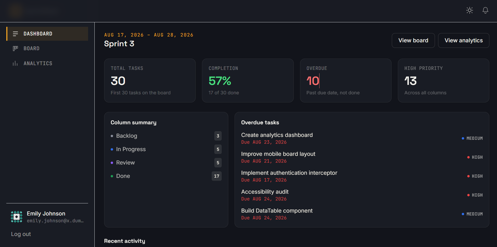
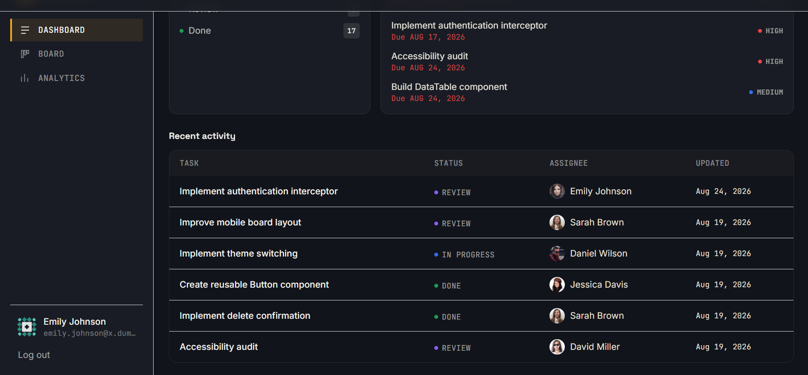
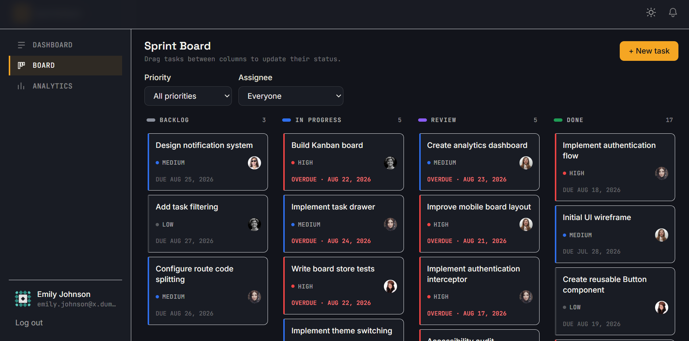
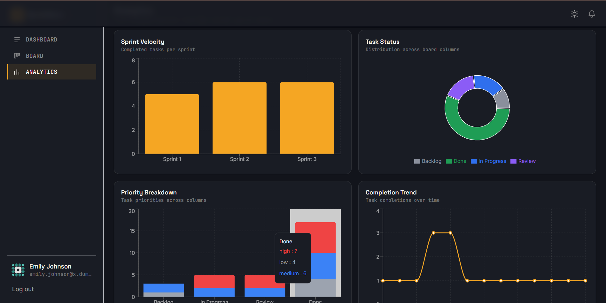

# SprintDesk — Sprint Management Dashboard

A production-oriented Kanban sprint management dashboard for software teams, built for
the Frontend Engineer take-home assignment. SprintDesk lets a team authenticate, manage
tasks on a drag-and-drop board, analyze sprint data, and receive simulated real-time
notifications — all as a single-page React application.

## Live Demo

**Live Application:**  
https://sprintdesk-gold.vercel.app/login

**GitHub Repository:**  
https://github.com/RaghavRR/sprintdesk

## Screenshots

### Dashboard






### Kanban Board




### Analytics




## Table of contents

- [Features](#features)
- [Tech stack](#tech-stack)
- [Getting started](#getting-started)
- [npm scripts](#npm-scripts)
- [Environment variables](#environment-variables)
- [Architecture](#architecture)
- [State management approach](#state-management-approach)
- [Authentication & token refresh](#authentication--token-refresh)
- [Notification polling](#notification-polling)
- [Drag & drop](#drag--drop)
- [Analytics](#analytics)
- [Accessibility](#accessibility)
- [Performance](#performance)
- [Testing](#testing)
- [Folder structure](#folder-structure)
- [Assumptions & simulated behaviour](#assumptions--simulated-behaviour)
- [Known limitations](#known-limitations)
- [Bonus features implemented](#bonus-features-implemented)
- [Deployment](#deployment)

## Features

- **Authentication** — DummyJSON-backed login, in-memory access token, persisted refresh
  token, silent session restore on reload, automatic refresh-and-retry on 401, protected
  routes, logout, full-screen session-validation loader, Remember Me, password strength
  meter.
- **Kanban board** — 4 columns (Backlog, In Progress, Review, Done), drag-and-drop within
  and across columns (mouse + keyboard) via `@dnd-kit`, task drawer with edit + comments,
  create/delete (with confirmation) tasks, priority/assignee filters, board state
  persisted to `localStorage`.
- **Analytics** — Sprint Velocity, Task Status distribution, Priority Breakdown, and
  Completion Trend, all derived live from the actual board state via Recharts.
- **Notifications** — Polled "activity feed" (simulated via JSONPlaceholder), unread
  count, mark as read / mark all as read, pagination past 20 items, pauses when the tab
  is hidden, toasts on new arrivals while the panel is closed.
- **Design system** — Button, Input, Select, Modal, Drawer, Toast, DataTable, Skeleton,
  Badge, Avatar, EmptyState, ErrorState — all built from scratch on Tailwind CSS.
- **Theming** — persisted light/dark mode across the whole app.
- **Dashboard** — sprint overview, completion %, overdue tasks, priority summary, recent
  activity, quick links to Board/Analytics.

## Tech stack

| Concern | Choice |
| --- | --- |
| Framework | React 18+ (project scaffolded on React 19, which satisfies "18+") |
| Language | TypeScript, `strict: true` |
| Build tool | Vite |
| Server state | TanStack Query v5 |
| Client state | Zustand (persisted via its `persist` middleware where relevant) |
| Styling | Tailwind CSS v3 + a small amount of custom CSS |
| Routing | React Router v6+ |
| Charts | Recharts |
| Drag & drop | `@dnd-kit/core` + `@dnd-kit/sortable` |
| HTTP | axios (with a custom auth interceptor) |
| Testing | Vitest + React Testing Library |

No prohibited libraries (Next.js, MUI, Chakra, shadcn, `react-beautiful-dnd`, etc.) are
used anywhere in the project.

## Getting started

```bash
npm install
npm run dev       # http://localhost:5173
```

**Demo credentials** (DummyJSON's seeded users): `emilys` / `emilyspass`.

## npm scripts

| Script | What it does |
| --- | --- |
| `npm run dev` | Start the Vite dev server |
| `npm run build` | Type-check (`tsc -b`) and produce a production build in `dist/` |
| `npm run preview` | Preview the production build locally |
| `npm run test` | Run the full Vitest suite once |
| `npm run test:watch` | Run Vitest in watch mode |
| `npm run typecheck` | Type-check only, no emit |
| `npm run lint` | Run `oxlint` over `src/` |

## Environment variables

SprintDesk needs **no secrets** to run — DummyJSON and JSONPlaceholder are public,
unauthenticated-by-API-key services. `.env.example` documents two optional overrides:

```
VITE_AUTH_API_BASE_URL=https://dummyjson.com
VITE_NOTIFICATIONS_API_BASE_URL=https://jsonplaceholder.typicode.com
```

Copy it to `.env` only if you want to point the app at different hosts (e.g. a real
backend later). The app runs correctly with no `.env` file at all, using the defaults
above.

## Architecture

See [`ARCHITECTURE.md`](./ARCHITECTURE.md) for the full write-up with Mermaid diagrams.
In short:

```
UI Components → Hooks / Query layer → Service layer → dataSource.ts → mock-data.json
```

`src/services/dataSource.ts` is the **only** module that imports `mock-data.json`
directly. Every other module — services, hooks, components — depends on the functions
exported from `services/*.ts`, so replacing the mock data source with a real backend
later means changing `dataSource.ts` (and, for auth, `services/auth.service.ts`), not the
UI.

## State management approach

- **Server state** (TanStack Query): the initial board fetch (`useBoardData`), users,
  sprints, session validation (`/auth/me`), and notification polling. Query owns
  loading/error/caching/refetch/invalidation for all of these.
- **Client/app state** (Zustand): `authStore` (in-memory access token + session status),
  `boardStore` (the working Kanban board — tasks, comments, filters, selection —
  persisted to `localStorage`), `notificationStore` (persisted notification list,
  read/unread, pagination), `themeStore` (persisted light/dark), `toastStore` (ephemeral,
  not persisted).
- **Local component state**: form inputs (Login, Create Task, Task Drawer edit form),
  UI-only toggles (mobile nav open, notification panel open).

The board intentionally hands off from TanStack Query to Zustand exactly once
(`useBoardData`): the *initial* 30 tasks are genuinely server state (fetched, cached,
loading/error-aware), but once loaded the board is locally-owned interactive state —
that's what makes drag-and-drop feel instant and lets it persist across refreshes without
re-fetching.

## Authentication & token refresh

- `POST /auth/login` (DummyJSON) with `expiresInMins: 1` — the access token is
  deliberately short-lived so the refresh flow is exercised continuously during normal
  use, not just in theory.
- The **access token lives in memory only** (`stores/authStore.ts`), never in
  `localStorage`/`sessionStorage`.
- The **refresh token** is persisted via `lib/tokenStorage.ts`: `localStorage` with a
  simulated 30-day expiry if "Remember me" is checked, otherwise `sessionStorage` (survives
  a page refresh, cleared when the tab closes).
- `lib/httpClient.ts` is a dedicated axios instance with:
  - a **request interceptor** that attaches `Authorization: Bearer <token>` from the
    store,
  - a **response interceptor** that, on a 401, reads the persisted refresh token, calls
    `POST /auth/refresh`, updates the store + persisted refresh token, and **retries the
    original request exactly once**. Concurrent 401s are coalesced into a single in-flight
    refresh call.
- On app boot, `useSessionBootstrap` calls `GET /auth/me` with no access token in memory
  yet — this **deliberately** triggers a 401, which the interceptor turns into a real
  refresh + retry against DummyJSON. If there's no valid refresh token, the user is
  redirected to `/login`. While this resolves, a full-screen loader is shown.
- Once authenticated, a lightweight 45-second "heartbeat" re-fetch of `/auth/me` keeps
  the session silently refreshed in the background for as long as the tab stays open and
  the refresh token remains valid.
- Logout clears the persisted refresh token, the in-memory access token, and redirects to
  `/login`.

## Notification polling

- `services/notification.service.ts` polls
  `GET https://jsonplaceholder.typicode.com/posts?_limit=5` every 15 seconds via
  TanStack Query, mapping each post to a notification (namespaced IDs to avoid colliding
  with the seed notifications from `mock-data.json`).
- TanStack Query's default `refetchIntervalInBackground: false` is exactly the
  "pause when tab hidden, resume when visible" behaviour the spec asks for — no manual
  `visibilitychange` listener needed.
- New, previously-unseen post IDs are merged into `notificationStore` (persisted). If the
  notification panel is closed when new items arrive, a toast is shown.
- The panel shows the latest 20 by default with a "Load more" control once there are more
  than 20 stored notifications.

## Drag & drop

Implemented with `@dnd-kit/core` + `@dnd-kit/sortable`. Each column is a droppable +
sortable context; `PointerSensor` (4px activation distance, so clicks to open the drawer
aren't mistaken for drags) and `KeyboardSensor` (with `sortableKeyboardCoordinates`) are
both registered, so drag-and-drop is keyboard-accessible: `Tab` to a card, `Space` to pick
it up, arrow keys to move it, `Space` again to drop, `Escape` to cancel. Dropping outside
any valid target is a no-op (drag cancellation). `boardStore.moveTask` recomputes the
`order` field for the affected column(s) and persists the result.

## Analytics

All four charts (`features/analytics/selectors.ts`) are pure functions over the live
`boardStore.tasks` array — nothing is hardcoded. They recompute automatically (via
`useMemo`) whenever the board changes, and the page is responsive down to a 375px
viewport.

## Accessibility

- Semantic HTML, labelled form fields (`Input`/`Select` always render a real
  `<label htmlFor>`), `aria-invalid`/`aria-describedby` on error states.
- Modal and Drawer share a `useFocusTrap` hook: focus moves into the dialog on open,
  `Tab`/`Shift+Tab` are trapped inside it, `Escape` closes it, and focus returns to the
  triggering element on close.
- Visible focus rings everywhere via a shared `.focus-ring` utility class.
- Kanban cards are `role="button"`, keyboard-activatable (`Enter`/`Space`), and carry a
  descriptive `aria-label`; drag-and-drop itself is keyboard-operable (see above).
- Toasts use `role="status"` / `aria-live="polite"`; the notification bell exposes its
  unread count via `aria-label`.
- No headless-Chrome / Lighthouse-CI environment was available in this sandbox to produce
  a numeric score; the app was built and manually reviewed against the ≥92 target
  (labels, contrast, focus order, alt text) rather than machine-verified. See
  [Known limitations](#known-limitations).

## Performance

- Route-level code splitting via `React.lazy` + `Suspense` for `/login`, `/dashboard`,
  `/board`, `/analytics` (confirmed as separate chunks in the production build output).
- `React.memo`/`useMemo`/`useCallback` used where they have a real payoff: analytics
  selectors, board column grouping, user/id lookup maps — not sprinkled everywhere.
- TanStack Query caches users/sprints/initial board with `staleTime: Infinity` (they're
  effectively static "seed" data once loaded) to avoid redundant simulated-network
  round-trips.
- As with accessibility, no Lighthouse-CI run was available in this sandbox; see
  [Known limitations](#known-limitations).

## Testing

`npm run test` runs the required suites plus supporting coverage:

- `src/hooks/__tests__/useToast.test.ts` — success/error/info/warning toasts, unique IDs,
  manual dismiss, auto-dismiss timeout.
- `src/stores/__tests__/boardStore.test.ts` — hydrate-once semantics, `addTask`,
  `moveTask` (cross-column, same-column reorder, `completedAt` side-effects),
  `deleteTask` (including the "deleting the currently selected task" edge case).
- `src/lib/__tests__/httpClient.test.ts` — the auth interceptor: attaching the bearer
  token, refresh-then-retry on 401, no-double-retry guard, session teardown when refresh
  itself fails, pass-through of non-401 errors.

All 19 tests pass; `npm run typecheck` and `npm run build` are clean.

## Folder structure

```
src/
  app/            # QueryClient setup
  components/ui/  # Design system: Button, Input, Select, Modal, Drawer, Toast, DataTable...
  data/           # mock-data.json (verbatim copy of the provided fixture)
  features/
    auth/         # LoginPage, route guards, password strength meter
    board/        # BoardPage + Column/TaskCard/TaskDrawer/CreateTaskModal/...
    analytics/    # AnalyticsPage + chart components + pure selectors
    dashboard/    # DashboardPage + StatCard
    notifications/# NotificationBell, NotificationPanel
  hooks/          # useAuth, useToast, useNotifications, useBoardData, useFocusTrap...
  layouts/        # AppLayout (sidebar/topbar/mobile nav)
  lib/            # httpClient (axios + interceptor), tokenStorage
  routes/         # AppRoutes (lazy-loaded route tree)
  services/       # auth/task/user/sprint/notification service layer + dataSource.ts
  stores/         # authStore, boardStore, notificationStore, themeStore, toastStore
  test/           # Vitest global setup
  types/          # Domain + auth types
  utils/          # formatDate, passwordStrength
```

## Assumptions & simulated behaviour

- **Token expiry is real, but tuned short.** DummyJSON issues genuine JWTs; we ask for
  `expiresInMins: 1` so the refresh flow runs naturally during a normal session instead
  of only being reachable in theory.
- **Board mutations never touch `mock-data.json`.** The file is copied into `src/data/`
  and treated as an immutable fixture, exactly like a real API response. All writes live
  in `boardStore`'s persisted Zustand state, layered on top of the original fetch — this
  is the "client-side persistence layer" the assignment describes.
- **Notifications from JSONPlaceholder** don't have real timestamps in their payload, so
  polled notifications are stamped with the client's current time when received.
- **New task IDs / comment IDs** are generated client-side (`max(existing) + 1`), as
  there's no real backend to assign them.
- **Sprint assignment for new tasks** defaults to the most recent sprint in the mock data
  (Sprint 3), since the create-task form doesn't expose sprint selection (not required by
  the spec).

## Known limitations

- **Lighthouse scores were not machine-verified in this environment** (no headless
  Chrome / Lighthouse CI available in the build sandbox). The app was built with the
  ≥88 performance / ≥92 accessibility targets in mind (code splitting, semantic HTML,
  focus management, label coverage) but you should run `npm run build && npm run preview`
  and audit locally with Chrome DevTools to get real numbers before submitting.
- **Priority/assignee filters interact with drag reordering on the visible subset**, not
  the full column — dragging while a filter is active reorders relative to what's shown,
  not the entire underlying column. Clearing filters before reordering avoids any
  surprises.
- **Undo drag/drop** and **PNG analytics export** (both listed as optional bonuses) were
  not implemented, to keep the required functionality solid rather than spreading effort
  thin — see [Bonus features implemented](#bonus-features-implemented) for what *was*
  built.
- **Storybook and axe-core** (optional bonuses) were not set up, for the same reason.

## Bonus features implemented

- ✅ Remember Me (30-day simulated refresh-token persistence)
- ✅ Password strength indicator
- ✅ Filter by priority
- ✅ Filter by assignee
- ✅ Keyboard-accessible drag-and-drop (`@dnd-kit` `KeyboardSensor`)

Not implemented (see [Known limitations](#known-limitations)): undo drag/drop, custom
analytics date-range filtering, PNG export, Storybook, axe-core testing.

## Deployment

The app is a static SPA after `npm run build` (output in `dist/`) — it can be deployed to
any static host (Vercel, Netlify, GitHub Pages, Cloudflare Pages, etc.) with a SPA
fallback rule (serve `index.html` for unmatched routes, since routing is client-side via
React Router). No server-side environment variables are required for a working deployment
(see [Environment variables](#environment-variables)).

# 👨‍💻 Author

**Raghav Rastogi**

Frontend Developer | React | TypeScript | JavaScript

GitHub: https://github.com/RaghavRR/sprintdesk
